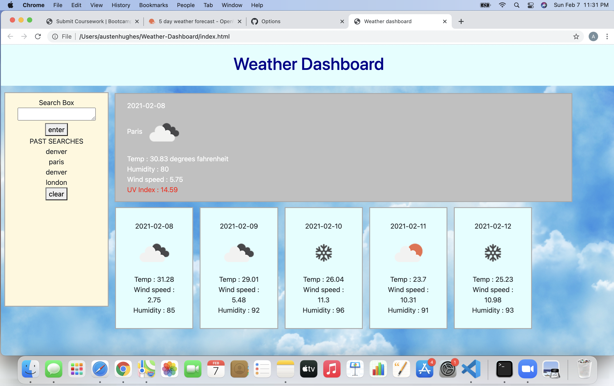

# Weather-Dashboard

Here you will find a weather dashboard. 

Basic functions:

- you will find a search bar on the left where you can enter city names from both near by and around the world. 

- If there is a matching city the information will be fetched from OpenWeather API. 

- Once fetched it will be displayed on a series of 6 display boxes. 

- The largest box found above the other five boxes will display the current days weather information for the selected city. The information displayed will be, date, city name, an icon displaying weather condition, temperature, wind speed, humidity, uv index.
the 

- The other five boxes will display the next 5 days weather forecast for chosen city. The information displayed will be the date for this forecast, an icon to display weather condition, temperature, humidity.

Extra features :

- uv index : the color of the the uv index text will change color based on how safe it is expected to be. 
        green : low
        yellow : moderate
        orange : high
        red : very high 

- local storage : Citys searched will be stored in the local storage. they will persist when the page is reloaded. they can be cleared with the clear button found beneath them. 

- click to search the city again : Each searched city will be added to a list stored beneath the search bar. this search bar will build until cleared. when the page is reloaded the past searches will load again unless cleared with clear button. *** if you click on any city on the list you will reload the weather info for that city to the page again.

Used in site :
OpenWeather API
Bootstrap
Local storage

picture of site : 

link to site : https://austenhughes.github.io/Weather-Dashboard/